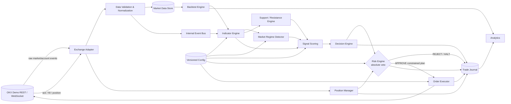
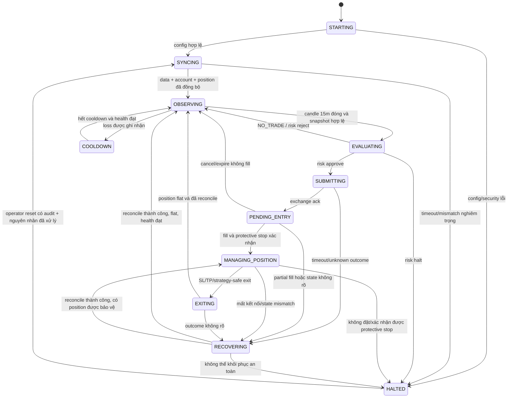

# System Architecture — PHASE 1

## 1. Mục tiêu và nguyên tắc thiết kế

Hệ thống được thiết kế cho `BTC-USDT-SWAP` trên OKX Demo Trading, chạy local với
Python 3.12+. Mục tiêu không phải tạo nhiều giao dịch mà chỉ giao dịch khi setup
đủ rõ, dữ liệu hợp lệ và Risk Engine cho phép.

Các bất biến (invariants) cấp hệ thống:

1. `NO_TRADE` là trạng thái mặc định và là một quyết định hợp lệ phải được ghi journal.
2. Không được tạo `OrderIntent` nếu chưa xác định regime.
3. Mọi lệnh mở vị thế phải có entry dự kiến, stop-loss, take-profit, kích thước,
   risk USDT và expected RR trước khi đi qua executor.
4. Risk Engine độc lập và có quyền `VETO` tuyệt đối; Signal, AI hoặc Executor không
   được sửa hay bỏ qua kết quả này.
5. Position size được tính từ mức lỗ tại stop-loss, không tính đơn giản từ
   `equity × leverage`.
6. Không martingale, không revenge trading, không averaging down vô hạn và không
   tự tăng leverage để gỡ lỗ.
7. Dữ liệu chưa đóng không được dùng như candle đã đóng. Backtest không được
   look-ahead hoặc data leakage.
8. Trạng thái từ sàn là nguồn sự thật cho order/fill/position; local state phải
   đối soát trước khi tiếp tục giao dịch sau reconnect hoặc restart.
9. Live trading phải fail-closed: cấu hình thiếu, mâu thuẫn hoặc không xác nhận rõ
   đều dẫn đến không gửi lệnh.
10. Mọi transition quan trọng, quyết định, veto và kill-switch đều có audit record.

## 2. Ranh giới hệ thống

### Trong phạm vi thiết kế

- Candle 5m (micro structure), 15m (entry), 1h (higher-timeframe context).
- Pipeline deterministic từ dữ liệu đến quyết định, risk, execution và journal.
- Backtest dùng chung logic indicator/regime/strategy/risk với paper trading.
- SQLite cho MVP, với repository interface để có thể thay storage về sau.
- OKX Demo là execution venue đầu tiên trong phase triển khai sau này.

### Ngoài phạm vi PHASE 1

- Code kết nối OKX, API key, WebSocket hoặc gửi order.
- Tối ưu tham số, khẳng định strategy có lợi nhuận, live trading và AI ra quyết định.
- UI, multi-symbol, portfolio optimization và distributed deployment.

## 3. Kiến trúc logic



### Dependency rules

- Domain modules không import SDK OKX. Chỉ Exchange Adapter được biết schema của OKX.
- Strategy tạo `TradeCandidate`, không tạo exchange order.
- Risk Engine nhận candidate và trả về kết quả mới, không mutate candidate.
- Executor chỉ nhận `ApprovedTradePlan` có `risk_approval_id`; không nhận tín hiệu thô.
- Backtest inject clock, market feed và simulated executor nhưng dùng cùng domain logic.
- Journal chỉ ghi append-oriented; analytics không tham gia quyết định giao dịch.
- AI (nếu có ở phase sau) chỉ là advisor đứng trước Strategy Validation, không nằm
  trên đường bypass Risk Engine.

## 4. Hợp đồng dữ liệu cốt lõi

Các model dưới đây là thiết kế logic; kiểu dữ liệu cụ thể sẽ chốt ở PHASE 2.

| Model | Trường bắt buộc chính | Quy tắc |
|---|---|---|
| `Candle` | symbol, timeframe, open_time, close_time, OHLCV, is_closed, source | UTC, thứ tự tăng dần, OHLC hợp lệ |
| `MarketSnapshot` | timestamp, closed candles 5m/15m/1h, bid, ask, freshness | Immutable; cùng observation time |
| `IndicatorSnapshot` | EMA20/50/200, RSI, ADX, ATR, bands, volume stats, warmup status | Gắn config/data version |
| `RegimeAssessment` | regime, confidence/evidence, reasons, as_of | Một trong 5 enum; thiếu bằng chứng → `UNCERTAIN` |
| `LevelSet` | supports, resistances, swing points, range bounds | Mỗi level có phương pháp và thời điểm tạo |
| `SignalAssessment` | long_score, short_score, components, gates, reasons | Điểm bị clamp 0–100; giải thích được |
| `TradeCandidate` | side, entry model, stop model, target model, signal context | Chưa được phép gửi sàn |
| `RiskContext` | equity, exposure, limits, daily stats, spread, health, position state | Snapshot nhất quán tại lúc đánh giá |
| `RiskDecision` | APPROVE/REJECT/HALT, codes, limits applied, expires_at | `HALT` kích hoạt kill switch |
| `ApprovedTradePlan` | entry, SL, TP, size, leverage, risk, RR, approval id/expiry | Immutable; hết hạn phải đánh giá lại |
| `ExecutionReport` | client/order ids, requested/filled qty, avg price, fees, status | Idempotent theo event/order id |
| `DecisionRecord` | toàn bộ context, decision, reasons, config/data/code version | Ghi cả `NO_TRADE` |

Tiền và giá dùng decimal/fixed precision phù hợp instrument metadata; không dùng
binary float cho sizing hoặc order quantity. Mọi thời gian được lưu UTC, chỉ đổi
timezone ở lớp hiển thị.

## 5. Trách nhiệm module

| Module | Trách nhiệm | Không được làm |
|---|---|---|
| `config` | Load, validate và version config; tách demo/live | Im lặng dùng giá trị nguy hiểm khi config lỗi |
| `market_data` | Ingest, normalize, deduplicate, backfill và kiểm tra freshness/gap | Tạo tín hiệu |
| `indicators` | Tính indicator chỉ từ dữ liệu đã có tại `as_of` | Đọc dữ liệu tương lai hoặc tự ra lệnh |
| `regime` | Phân loại `TREND_UP`, `TREND_DOWN`, `SIDEWAY`, `HIGH_VOLATILITY`, `UNCERTAIN` | Ép về long/short khi không chắc chắn |
| `levels` | Xác định support/resistance, swing, range và breakout/retest state | Hard-code mức giá cố định |
| `strategy` | Tạo score có thành phần, áp gate và sinh decision/candidate | Tính size hoặc bypass risk |
| `risk` | Kiểm tra account/market/system limits, sizing, RR, leverage, veto/kill switch | Nhận leverage từ AI hoặc nới limit động để gỡ lỗ |
| `execution` | Map approved plan sang order, idempotency, ack/fill/cancel, protective stop | Gửi candidate chưa được approve |
| `positions` | State position, TP/SL, break-even/trailing, reconciliation và recovery | Tin local state khi khác sàn |
| `journal` | Persist decisions, reasons, orders, fills, PnL, fees, funding, events | Thay đổi quyết định quá khứ |
| `backtest` | Event-driven replay, fill/fee/funding/slippage model, chống look-ahead | Dùng logic khác để làm đẹp kết quả |
| `analytics` | Metrics tổng thể, long/short và theo regime | Tham gia execution path |
| `monitoring` | Health, data/API latency, alert, kill-switch visibility | Tự resume khi chưa xác minh nguyên nhân |
| `ai` (tùy chọn) | Giải thích/context/anomaly recommendation | Sizing, leverage, bỏ SL hoặc gửi order |

## 6. Data flow

1. Adapter nhận market/account events, gắn source timestamp và receive timestamp.
2. Validator chuẩn hóa schema, loại duplicate, phát hiện out-of-order, gap và stale data.
3. Candle đã đóng được lưu; snapshot đa timeframe chỉ phát khi đủ dữ liệu và đồng bộ.
4. Indicator Engine tạo snapshot bất biến. Warm-up chưa đủ dẫn tới `NO_TRADE`.
5. Regime và S/R được tính từ cùng snapshot để tránh lệch thời điểm.
6. Signal Scoring tính điểm hai phía cùng component breakdown; Decision Engine áp
   regime gate, threshold và minimum score difference.
7. Mọi kết quả, kể cả `NO_TRADE`, được ghi journal trước khi chu kỳ kết thúc.
8. Candidate hợp lệ đi vào Risk Engine cùng account/market/system snapshot mới nhất.
9. Risk Engine reject, halt hoặc phát hành approved plan có TTL ngắn.
10. Executor revalidate các điều kiện dễ đổi (approval TTL, spread, state, duplicate)
    trước khi gửi order; report quay về Position Manager và Journal.
11. Position Manager đối soát fills/position, bảo đảm protective stop và quản lý exit.

Trong backtest, adapter/executor thật được thay bằng historical feed và simulator.
Luồng domain từ bước 3 đến bước 9 không thay đổi.

## 7. State machine của bot



`HALTED` chặn mọi entry mới nhưng không được bỏ mặc vị thế đang mở: hệ thống vẫn
ưu tiên reduce-only/cancel/protect/reconcile theo runbook an toàn. Việc reset phải
là thao tác có chủ đích, có lý do và được journal; không auto-reset chỉ vì hết thời gian.

## 8. Failure scenarios và hành vi fail-safe

| Scenario | Phát hiện | Hành vi bắt buộc |
|---|---|---|
| Thiếu/gap/stale candle | Sequence, close time, freshness SLA | Không đánh giá tín hiệu; backfill; lặp lại → `HALTED` |
| Indicator chưa warm-up/NaN | Validation trên snapshot | `NO_TRADE`, ghi reason |
| Không xác định regime | Evidence/confidence không đạt | Gán `UNCERTAIN`, `NO_TRADE` |
| REST/WebSocket disconnect | Heartbeat, timeout, error rate | Chặn entry; reconnect và reconcile; nghiêm trọng → halt |
| Dữ liệu REST và WS khác nhau | Cross-check close/position/order | Tạm dừng, chọn authoritative snapshot, không đoán |
| Spread bất thường | Bid/ask và configurable limit | Risk reject; kéo dài/bất thường → halt |
| Slippage vượt limit | Fill so với approved/reference price | Dừng entry mới, quản lý exposure, halt và journal |
| Order timeout/ack không rõ | Missing ack trong SLA | Không gửi lại mù quáng; query bằng client order id |
| Duplicate event/order | Stable id + idempotency key | Bỏ duplicate nhưng vẫn audit |
| Partial fill | Cumulated fills/order state | Recompute exposure; đặt protection cho phần đã fill hoặc reduce-only |
| Không đặt/xác nhận được SL | Protective-order acknowledgement | Không mở thêm; đóng/reduce vị thế theo policy; `HALTED` |
| Local/exchange position mismatch | Scheduled + event reconciliation | Exchange là source of truth; chặn entry; recover hoặc halt |
| Restart khi có position | Startup reconciliation | Không trade trước khi phục hồi order/position/protection |
| Daily loss/consecutive loss vượt limit | Realized PnL ledger | Kill switch, cancel entry orders, không auto-reset |
| Equity/margin bất thường | Bounds/change-rate/account status | Halt, không tăng leverage hoặc size |
| DB write failure | Transaction error/health check | Chặn entry mới; không giao dịch không audit |
| Clock drift/out-of-order | Server time offset, monotonic sequence | Không tạo snapshot; resync time/data |
| Config thay đổi giữa chu kỳ | Config version/hash | Candidate cũ hết hiệu lực; đánh giá lại |
| Process crash giữa submit và persist | Write-ahead intent + client id | Startup query/reconcile trước bất kỳ retry nào |

## 9. Cấu trúc thư mục đề xuất

```text
trading_bot/
├── pyproject.toml
├── README.md
├── .env.example
├── config/
│   ├── base.example.yaml
│   ├── demo.example.yaml
│   └── live.example.yaml
├── docs/
│   ├── architecture.md
│   ├── trading-flow.md
│   ├── strategy.md
│   ├── regime-detection.md
│   ├── risk-management.md
│   ├── position-sizing.md
│   ├── backtesting.md
│   ├── okx-demo.md
│   ├── security.md
│   └── configuration.md
├── src/trading_bot/
│   ├── domain/          # immutable models, enums, domain events
│   ├── config/          # typed config + validation
│   ├── market_data/     # feed, validation, aggregation, repository
│   ├── indicators/
│   ├── regime/
│   ├── levels/
│   ├── strategy/        # scoring + decision
│   ├── risk/            # limits, sizing, veto, kill switch
│   ├── execution/       # ports, OKX adapter, simulator
│   ├── positions/
│   ├── journal/
│   ├── backtest/
│   ├── analytics/
│   ├── monitoring/
│   ├── ai/              # optional and disabled by default
│   └── app/             # orchestration/entrypoints
├── migrations/
├── scripts/
├── data/
│   ├── raw/             # immutable; ignored by Git
│   └── processed/       # reproducible outputs; ignored by Git
└── tests/
    ├── unit/
    ├── integration/
    ├── contract/
    ├── backtest/
    └── fixtures/
```

`src` layout tránh import nhầm từ working directory. `domain` tách model khỏi
infrastructure. `contract` tests xác nhận adapter/simulator tuân cùng interface.
Các file config thật, database, logs, dữ liệu và secrets không commit vào Git.

## 10. Assumptions/hypotheses cần kiểm chứng bằng backtest

Đây là giả thuyết, không phải sự thật đã được chứng minh:

| Giả thuyết | Cách kiểm chứng tối thiểu |
|---|---|
| 1h regime cải thiện expectancy của entry 15m | Ablation có/không regime filter, out-of-sample |
| 5m confirmation giảm false entry mà không làm trễ quá mức | So sánh expectancy, MAE/MFE và missed trades |
| EMA/ADX/market structure phân biệt trend và range ổn định | Confusion/stability theo nhiều giai đoạn volatility |
| Mean-reversion ở biên SIDEWAY có lợi thế sau phí | Chỉ test entry gần range edge; fee/slippage stress |
| Mid-range `NO_TRADE` giảm drawdown/overtrade | So sánh trade count, PF, expectancy, drawdown |
| Breakout-confirmation-retest tốt hơn breakout tức thời | So sánh false-break rate, fill rate, net expectancy |
| Volume/momentum confirmation tạo giá trị bổ sung | Component ablation, không chọn mẫu theo kết quả |
| ATR/swing/level stop tốt hơn fixed-percent stop | So sánh net expectancy, stop frequency, tail loss |
| Score threshold và score difference có tính ổn định | Walk-forward surface; tìm plateau thay vì optimum đơn lẻ |
| Minimum RR filter tương quan với realized RR | Calibration planned RR so với realized RR sau phí |
| Risk/trade và limits giữ drawdown trong tolerance | Monte Carlo trade-order/bootstrap + stress sequence |
| Maker/taker assumptions thực tế | Nhiều fill scenarios, adverse selection và latency |
| Strategy còn lợi nhuận sau mọi chi phí | Entry/exit fee, funding, spread, slippage stress |
| Hiệu quả tồn tại ở cả market regimes liên quan | Báo cáo riêng trend up/down/sideway/high-volatility |

Quy trình đánh giá phải dùng đủ lịch sử qua nhiều regime, chronological split,
walk-forward, tập holdout cuối cùng chưa dùng để chỉnh tham số và sensitivity test.
Không tối ưu theo vài ngày dữ liệu. Mọi kết quả phải báo net PnL sau phí cùng profit
factor, expectancy, drawdown và risk-adjusted return; win rate không đủ để kết luận.

## 11. Quyết định cần chốt ở PHASE 2

- Chế độ OKX account/position (`net` hay long/short), margin mode và instrument precision.
- Nguồn/độ sâu lịch sử, chính sách gap và thời gian warm-up cho EMA200 1h.
- Công thức regime, S/R, score component và toàn bộ threshold trong typed config.
- Entry/SL/TP order types, partial-fill policy và emergency-exit policy.
- Định nghĩa timezone/session cho daily loss reset (khuyến nghị UTC).
- PnL semantics: realized/unrealized, fee/funding attribution và equity baseline.
- Mô hình fill, latency, spread, slippage và funding trong backtest.
- Recovery runbook và quyền operator reset kill switch.

## 12. Acceptance criteria của PHASE 1

PHASE 1 chỉ hoàn thành khi review xác nhận tất cả tiêu chí sau:

- [ ] Kiến trúc thể hiện đầy đủ Market Data → Indicators → Regime/S&R → Signal →
      Decision → Risk → Execution → Position → Journal/Analytics.
- [ ] Quyền veto tuyệt đối của Risk Engine và ranh giới AI được ghi rõ, không có
      đường nào bypass risk.
- [ ] `NO_TRADE`, `UNCERTAIN`, SIDEWAY edge logic và breakout-confirmation-retest
      được mô tả rõ.
- [ ] Hợp đồng dữ liệu chính, ownership và dependency rules đủ rõ để viết technical spec.
- [ ] State machine bao phủ startup, sync, observe, evaluate, submit, manage, exit,
      cooldown, recovery và halt.
- [ ] Các failure scenario trọng yếu có trigger và fail-safe response, gồm unknown
      order outcome, partial fill, missing SL, state mismatch và restart recovery.
- [ ] Risk flow định nghĩa pre-trade/in-flight/post-trade checks, sizing theo stop,
      limits, kill-switch và manual reset có audit.
- [ ] Data flow tách event time/receive time, chỉ dùng closed candle và chống
      look-ahead/data leakage.
- [ ] Kiến trúc cho phép backtest và paper trading dùng chung deterministic domain logic.
- [ ] Folder structure và trách nhiệm module không có vòng phụ thuộc nguy hiểm.
- [ ] Danh sách giả thuyết backtest và nguyên tắc validation được review.
- [ ] Các câu hỏi cần chốt cho PHASE 2 được gán quyết định rõ, không bị ngầm hard-code.
- [ ] Mermaid diagrams render hợp lệ và ba tài liệu không mâu thuẫn nhau.
- [ ] Không có code gửi lệnh, credential hoặc cơ chế bật live trading trong PHASE 1.
