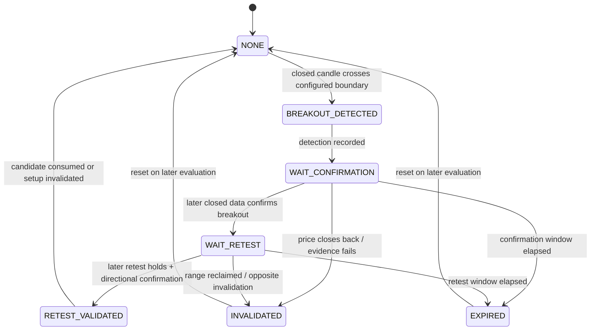

# Market Regime and SIDEWAY Specification — PHASE 2

## 1. Contract

Inputs:

- Valid, closed-candle `MarketSnapshot`.
- Ready `IndicatorSnapshot`.
- Point-in-time `MarketStructure` and `LevelSet`.
- Versioned `regime`/`levels` configuration.

Output: immutable `RegimeAssessment`:

- `regime: MarketRegime`
- `confidence: Decimal` trong `[0,1]`
- `candidate_regime: MarketRegime?`
- `candidate_scores: Mapping[MarketRegime, Decimal]`
- `evidence: tuple[RegimeEvidence,...]`
- `confirmation_count: int`
- `reason_codes: tuple[ReasonCode,...]`
- `as_of: datetime UTC`
- `config_version`, `strategy_version`

Detector không tạo `TradeCandidate`, không biết account/risk và không gọi exchange.

## 2. Deterministic evaluation order

1. Validate input identity, versions, readiness và `as_of`.
2. Nếu data/indicator/structure invalid hoặc thiếu: `UNCERTAIN`.
3. Tính các evidence atom độc lập cho trend, range và volatility.
4. Aggregate evidence bằng configured weights/rules.
5. Áp conflict policy và minimum evidence count.
6. Áp precedence: qualified high-volatility candidate → `HIGH_VOLATILITY`; nếu không,
   directional/range candidate chỉ được chọn khi evidence đủ và conflict trong tolerance.
7. Tie, evidence yếu hoặc contradictory → `UNCERTAIN`.
8. Trả assessment cùng full evidence/reason codes; không có side effect.

Tất cả thresholds, windows và weights là `BACKTEST_REQUIRED`. Không có rule đơn như
`EMA20 > EMA50 = TREND_UP` được phép quyết định regime.

Các hàm chuẩn hóa canonical:

```text
clamp01(x) = min(1, max(0, x))
ramp_up(x, start, full) = clamp01((x - start) / (full - start))
ramp_down(x, full, zero) = 1 - ramp_up(x, full, zero)
weighted_score(items, weights) = sum(items[name] × weights[name])
```

Config validation bắt buộc `full > start`, `zero > full`, weights không âm và tổng
weights của mỗi family bằng 1. Các constant 0/1 chỉ là bounds toán học, không phải
market threshold.

## 3. Evidence model và công thức candidate

Mỗi evidence atom có:

| Field | Meaning |
|---|---|
| `name` | Stable configured name |
| `supports` | Chính xác một trong `TREND_UP`, `TREND_DOWN`, `SIDEWAY`, `HIGH_VOLATILITY` |
| `strength` | Decimal `[0,1]` theo deterministic transform |
| `observed_value`, `unit` | Giá trị Decimal point-in-time và đơn vị tách riêng |
| `rule_version` | Config/strategy version |
| `source_ids` | Snapshot/structure/level IDs |

Candidate confidence là normalized aggregate theo công thức dưới đây; nó không phải
xác suất thắng và không được dùng thay signal score.

Các EMA/slope/ADX/price-location atoms được tính riêng cho `t ∈ {M15,H1}`, rồi:

```text
tf_weighted(atom) = sum(atom[t] × regime.timeframe_weights[t])
```

Weights có đúng hai keys, không âm và tổng 1. Với indicator values/close của từng
timeframe tại `as_of`:

```text
ema_up = 1 iff ema20 > ema50 > ema200, else 0
ema_down = 1 iff ema20 < ema50 < ema200, else 0

slope_up = min(
  ramp_up(ema20_slope_atr, minimum_slope_atr, full_slope_atr),
  ramp_up(ema50_slope_atr, minimum_slope_atr, full_slope_atr)
)
slope_down = min(
  ramp_up(-ema20_slope_atr, minimum_slope_atr, full_slope_atr),
  ramp_up(-ema50_slope_atr, minimum_slope_atr, full_slope_atr)
)

adx_trend = ramp_up(adx, adx.trend_start, adx.trend_full)
structure_up = 1 iff market_structure.trend == BULLISH, else 0
structure_down = 1 iff market_structure.trend == BEARISH, else 0
price_up = 1 iff close >= ema20 - price_location_tolerance_atr × atr, else 0
price_down = 1 iff close <= ema20 + price_location_tolerance_atr × atr, else 0

trend_up_score = weighted_score(
  {ema: tf_weighted(ema_up), slope: tf_weighted(slope_up),
   adx: tf_weighted(adx_trend), structure: structure_up,
   price_location: tf_weighted(price_up)},
  regime.weights.trend
)
trend_down_score = same formula with down evidence
```

SIDEWAY score:

```text
ema_dispersion_atr[t] = (max(ema20, ema50, ema200) - min(...)) / atr
ema_compression = ramp_down(
  ema_dispersion_atr, 0, maximum_sideway_dispersion_atr)
slope_flatness = min(
  ramp_down(abs(ema20_slope_atr), 0, maximum_sideway_slope_atr),
  ramp_down(abs(ema50_slope_atr), 0, maximum_sideway_slope_atr)
)
adx_weakness = ramp_down(adx, adx.sideway_full, adx.sideway_zero)
range = 1 iff RangeContext is valid and not stale, else 0
bounded_structure = 1 iff market_structure.trend == MIXED, else 0
sideway_score = weighted_score(
  {range: range, ema_compression: tf_weighted(ema_compression),
   slope_flatness: tf_weighted(slope_flatness),
   adx_weakness: tf_weighted(adx_weakness),
   bounded_structure: bounded_structure},
  regime.weights.sideway
)
```

HIGH_VOLATILITY score:

```text
atr_extreme[t] = ramp_up(atr_percentile, atr_percentile_start, atr_percentile_full)
bb_extreme[t] = ramp_up(bb_width_percentile, bb_percentile_start, bb_percentile_full)
true_range_atr = current_closed_candle_true_range / atr
range_shock = ramp_up(true_range_atr, true_range_atr_start, true_range_atr_full)
high_volatility_score = weighted_score(
  {atr_percentile: tf_weighted(atr_extreme),
   bb_width_percentile: tf_weighted(bb_extreme),
   true_range_shock: range_shock},
  regime.weights.high_volatility
)
```

ATR phải dương. Nếu denominator invalid/zero, output `UNCERTAIN` với
`INDICATOR_INVALID`; không thay bằng epsilon tùy ý.

## 4. Candidate qualification và precedence

Một candidate đủ điều kiện khi score `>=` candidate-specific threshold, score
`>= regime.minimum_confidence`, và số evidence atoms có strength
`>= regime.minimum_evidence_strength` đạt
`regime.minimum_evidence_count`.

Evidence count dùng đúng các atom trong family score: trend có `ema`, `slope`, `adx`,
`structure`, `price_location`; SIDEWAY có `range`, `ema_compression`, `slope_flatness`,
`adx_weakness`, `bounded_structure`; HIGH_VOLATILITY có `atr_percentile`,
`bb_width_percentile`, `true_range_shock`. Không đếm lại cùng atom theo timeframe sau
khi đã aggregate bằng `tf_weighted`.

Algorithm canonical:

1. Nếu input invalid/not-ready/stale → `UNCERTAIN`, confidence 0.
2. Nếu HIGH_VOLATILITY qualified → `HIGH_VOLATILITY` ngay, không hysteresis.
3. Nếu `min(trend_up_score, trend_down_score) >= regime.conflict_tolerance` →
   `UNCERTAIN` vì directional evidence conflict.
4. Tạo eligible set từ TREND_UP, TREND_DOWN, SIDEWAY.
5. Nếu set rỗng → `UNCERTAIN`.
6. Nếu cả UP và DOWN eligible → `UNCERTAIN`, bất kể SIDEWAY.
7. Nếu chỉ một candidate eligible → candidate đó.
8. Nếu một trend và SIDEWAY cùng eligible: chọn score cao hơn chỉ khi absolute
   difference `>= regime.minimum_candidate_margin`; nếu không → `UNCERTAIN`.
9. Candidate phải lặp đúng cùng regime trong `regime.required_confirmations`
   evaluations liên tiếp. Trong lúc chờ, output `UNCERTAIN`; HIGH_VOLATILITY là
   ngoại lệ an toàn ở bước 2.
10. Candidate đổi hoặc bị gián đoạn reset confirmation count về 1; invalid input reset 0.

`RegimeAssessment.candidate_scores` có chính xác bốn keys `TREND_UP`, `TREND_DOWN`,
`SIDEWAY`, `HIGH_VOLATILITY`; `UNCERTAIN` chỉ là outcome và không có score riêng.
`candidate_regime`,
`previous_confirmed_regime`, `confirmation_count` giúp replay transition. Confidence
bằng winning candidate score khi confirmed; bằng 0 khi output UNCERTAIN do conflict,
transition hoặc invalid input.

## 5. Evidence interpretation

### `TREND_UP`

Evidence bắt buộc được tính theo §3:

- M15/H1 EMA alignment, normalized slopes và price location.
- ADX strength được normalize bằng configured ramp, không chỉ một cross.
- Market structure có chuỗi confirmed HH/HL, không dùng pivot chưa confirm.
- Strategy tự kiểm pullback bằng configured distance; Regime Detector không gắn nhãn
  “price extension” ngoài các atoms ở §3.
- High-volatility score chưa qualified theo precedence ở §4.

Qualification dùng đúng evidence count và directional conflict rules ở §4; không có
thêm judgement về “evidence mạnh”.

### `TREND_DOWN`

Đối xứng với TREND_UP:

- EMA alignment/slopes và price location giảm.
- ADX/trend-strength supporting evidence.
- Confirmed LH/LL structure.
- Volatility guard theo high-volatility precedence.

Không suy ra TREND_DOWN chỉ vì RSI thấp hoặc một bearish candle.

### `SIDEWAY`

Candidate cần nhiều evidence:

- `RangeContext` valid, đủ tuổi, width và boundary tests theo config.
- EMA slopes/dispersion thể hiện thiếu directional expansion.
- ADX/trend-strength candidate yếu theo configured rule.
- Boundary test count/strength đạt exact rules ở §7 và structure là `MIXED` cho atom
  `bounded_structure`.
- Range width đạt `levels.minimum_range_width_atr`; profitability sau costs được kiểm
  riêng bởi Strategy/Risk RR gate.

Range invalid/quá hẹp theo §7 hoặc đang breakout chưa resolve không được
coi là mean-reversion setup dù regime assessment tạm còn SIDEWAY.

### `HIGH_VOLATILITY`

Evidence được tính bằng ba atoms ở §3:

- ATR normalized/percentile expansion.
- Bollinger width expansion và range/candle true-range shock.
- HIGH_VOLATILITY được chọn ngay khi score đạt threshold; không chờ regime
  confirmation vì đây là safety precedence.

MVP luôn map `HIGH_VOLATILITY` sang `NO_TRADE`. Threshold không hard-code trong spec.

### `UNCERTAIN`

Là fallback bắt buộc khi:

- Input không ready/stale/gap/version mismatch.
- Không candidate nào đạt evidence/confidence yêu cầu.
- Nhiều candidate xung đột vượt tolerance.
- Range/structure không xác định hoặc transition regime chưa ổn định.
- Numerical validation fail.

`UNCERTAIN` không phải lỗi cần “đoán” regime gần nhất; Strategy phải `NO_TRADE`.

## 6. Regime transition stability

Để tránh flip liên tục, detector bắt buộc dùng persistence theo config,
nhưng state phải point-in-time và reproducible:

- `candidate_regime` được journal mỗi evaluation.
- `confirmed_regime` chỉ đổi sau configured evidence/persistence rule.
- Hysteresis không được giữ trend cũ khi high-volatility/data-invalid hard gate xuất hiện.
- Restart khôi phục transition state từ journal; thiếu state → `UNCERTAIN`, không đoán.

Persistence parameters là `BACKTEST_REQUIRED` và phải đánh giá lag vs stability.

## 7. Level, structure và `RangeContext` construction

### Swing và market structure

- Swing high tại index `i` khi `high[i]` lớn hơn nghiêm ngặt mọi high trong
  `swing_left_bars` trước và `swing_right_bars` sau. Swing low đối xứng với `<`.
- Pivot chỉ có hiệu lực khi toàn bộ right-side bars đã closed; `confirmed_at` là close
  time của right-side bar cuối.
- Với hai swing highs và hai swing lows confirmed gần nhất, dùng tolerance
  `level_merge_distance_atr × ATR`: latest high lớn hơn prior high + tolerance là HH,
  nhỏ hơn prior high - tolerance là LH; latest low tương tự là HL/LL. Trong tolerance
  được coi equal và không tạo directional label.
- Thiếu hai confirmed highs hoặc lows → `UNDETERMINED`. HH + HL → `BULLISH`; LH + LL
  → `BEARISH`; mọi tổ hợp còn lại → `MIXED`.

### Level clustering và selection

1. Tách swing highs và swing lows; sort từng tập theo `(price, confirmed_at, candle_id)`.
2. Tạo deterministic connected clusters: hai pivot kề nhau thuộc cùng cluster khi
   price distance `<= level_merge_distance_atr × ATR(as_of)`.
3. Cluster representative là median Decimal price; zone bằng representative
   `± zone_half_width_atr × ATR`.
4. `test_count` là số pivot unique; `strength = min(1,
   test_count / full_strength_touches)`. Active khi test count và strength đạt config.
5. Support là active swing-low level có price lớn nhất nhưng zone không nằm hoàn toàn
   trên close; nếu bằng giá, chọn `level_id` lexicographically nhỏ nhất. Resistance là
   active swing-high level có price nhỏ nhất nhưng zone không nằm hoàn toàn dưới close,
   với tie-break tương tự. Thiếu một phía → range invalid.

Required fields:

- `support`, `resistance`, `range_width = resistance - support`.
- `range_mid = (support + resistance) / 2`.
- `position_in_range = (close - support) / range_width`.
- `range_width_atr = range_width / reference_atr`.
- `range_age_bars`, `support_tests`, `resistance_tests`.
- `current_location`.
- Breakout direction/state/timestamps và versions.

`last_validated_at = min(support.last_tested_at, resistance.last_tested_at)`. Range
valid khi boundaries active, `range_width > 0`, mỗi boundary đủ touches/strength,
`range_width_atr >= minimum_range_width_atr` và số 15m bars từ last validation
`<= maximum_range_stale_bars`. ATR zero/invalid → `UNCERTAIN`; stale → NO_TRADE
`RANGE_STALE`.

`range_started_at = max(support.confirmed_at, resistance.confirmed_at)` và
`range_age_bars` là số closed 15m intervals từ thời điểm đó đến `as_of`, tính theo
integer interval boundaries.

### Location classification

Với `p = position_in_range`, `s = support_zone_max_fraction`,
`r = resistance_zone_min_fraction`, `o = outside_tolerance_fraction`; config bắt buộc
`0 <= s < r <= 1`, `o >= 0`:

- `OUTSIDE_RANGE` iff `p < -o` hoặc `p > 1 + o`.
- `NEAR_SUPPORT` iff `-o <= p <= s`.
- `NEAR_RESISTANCE` iff `r <= p <= 1 + o`.
- `MIDDLE` iff `s < p < r`.

Nếu zones overlap do range quá hẹp, RangeContext invalid; không chọn edge gần hơn.

## 8. SIDEWAY decision invariants

| Condition | Allowed strategy action |
|---|---|
| `SIDEWAY + MIDDLE` | Chỉ `NO_TRADE`, reason `SIDEWAY_MIDDLE_RANGE` |
| `SIDEWAY + NEAR_SUPPORT` | Chỉ cân nhắc LONG; vẫn cần confirmation, volume/momentum, score và RR |
| `SIDEWAY + NEAR_RESISTANCE` | Chỉ cân nhắc SHORT; vẫn cần confirmation, volume/momentum, score và RR |
| `SIDEWAY + OUTSIDE_RANGE` | Không entry; chuyển breakout state machine |
| Range invalid/too narrow | `NO_TRADE` |

Không có `TradeCandidate` tại middle, lúc mới detect breakout hoặc khi retest chưa xảy ra.

## 9. Breakout/retest state machine



Event invariants:

- Detect, confirmation và retest không được cùng dựa trên future portions của một
  candle; mỗi transition sử dụng closed data available tại event `as_of`.
- `WAIT_RETEST` không tự entry. Không có retest trước expiry → `NO_TRADE`.
- Up breakout detect khi closed 15m close `> resistance + breakout_buffer_atr × ATR`;
  down breakout dùng `< support - buffer × ATR`.
- Confirmation chỉ dùng subsequent closed 15m bars. Up bar giữ khi close
  `>= resistance - breakout_hold_tolerance_atr × ATR`; down đối xứng. Mọi bar phải
  giữ; fail → `INVALIDATED`. Đủ `breakout_confirmation_bars` → `WAIT_RETEST`.
- Up retest xảy ra khi low nằm trong boundary `± retest_tolerance_atr × ATR`, close
  vẫn `>= resistance` và bullish candle confirmation theo `strategy.confirmation`.
  Down retest dùng high quanh support, close `<= support` và bearish confirmation.
- Không retest trong `retest_expiry_bars` subsequent 15m bars → `EXPIRED`.
- Candidate ID liên kết `range_id` và full transition history.
- Restart/replay khôi phục đúng state từ append-only events.

## 10. Regime gates cho Strategy

| Regime | LONG | SHORT |
|---|---|---|
| `TREND_UP` | Có thể xét theo-trend | Block trong MVP |
| `TREND_DOWN` | Block trong MVP | Có thể xét theo-trend |
| `SIDEWAY` | Chỉ edge support hoặc validated upward breakout | Chỉ edge resistance hoặc validated downward breakout |
| `HIGH_VOLATILITY` | Block | Block |
| `UNCERTAIN` | Block | Block |

Gate pass chỉ cho phép scoring/plan tiếp tục, không tương đương signal hoặc approval.

## 11. Required tests cho PHASE 3+

- Multi-evidence aggregation và single-indicator không đủ để classify.
- Bullish/bearish evidence symmetry; conflict/tie → UNCERTAIN.
- High-volatility precedence và data-invalid precedence.
- Structure point chỉ có hiệu lực tại `confirmed_at`.
- Range validity, overlapping zones, exact boundary locations.
- SIDEWAY middle không thể tạo candidate bằng mọi score.
- Breakout detect không entry; confirmation/retest phải là ordered closed events.
- Retest expiry/invalidation và restart replay cho cùng state.
- Determinism: cùng snapshots/config/state → assessment byte-equivalent sau canonical serialization.
