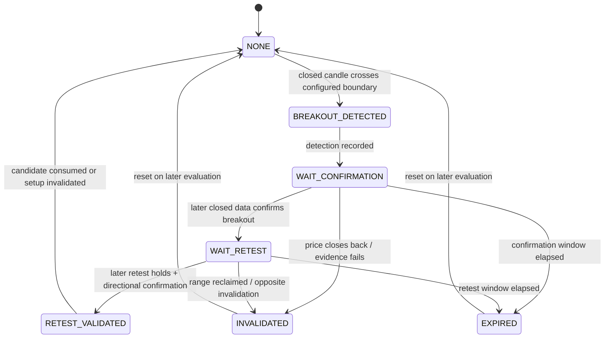

# Market Regime and SIDEWAY Specification — PHASE 2

## 1. Contract

Inputs:

- Valid, closed-candle `MarketSnapshot`.
- Ready `IndicatorSnapshot`.
- Point-in-time `MarketStructure` and `LevelSet`.
- Versioned `regime`/`levels` configuration.

Output: immutable `RegimeAssessment`:

- `regime: MarketRegime`
- `confidence: Decimal` trong `[0,1]`
- `evidence: tuple[str,...]`
- `reason_codes: tuple[ReasonCode,...]`
- `as_of: datetime UTC`
- `config_version`, `strategy_version`

Detector không tạo `TradeCandidate`, không biết account/risk và không gọi exchange.

## 2. Deterministic evaluation order

1. Validate input identity, versions, readiness và `as_of`.
2. Nếu data/indicator/structure invalid hoặc thiếu: `UNCERTAIN`.
3. Tính các evidence atom độc lập cho trend, range và volatility.
4. Aggregate evidence bằng configured weights/rules.
5. Áp conflict policy và minimum evidence count.
6. Áp precedence: severe high-volatility candidate → `HIGH_VOLATILITY`; nếu không,
   directional/range candidate chỉ được chọn khi evidence đủ và conflict trong tolerance.
7. Tie, evidence yếu hoặc contradictory → `UNCERTAIN`.
8. Trả assessment cùng full evidence/reason codes; không có side effect.

Tất cả thresholds, windows và weights là `BACKTEST_REQUIRED`. Không có rule đơn như
`EMA20 > EMA50 = TREND_UP` được phép quyết định regime.

## 3. Evidence model

Mỗi evidence atom có:

| Field | Meaning |
|---|---|
| `name` | Stable configured name |
| `supports` | Một regime candidate hoặc conflict/neutral |
| `strength` | Decimal `[0,1]` theo deterministic transform |
| `observed` | Giá trị point-in-time và unit |
| `rule_version` | Config/strategy version |
| `source_ids` | Snapshot/structure/level IDs |

Candidate confidence là normalized aggregate của evidence ủng hộ sau conflict
penalty. Công thức cụ thể phải được ghi version và backtest; confidence không phải
xác suất thắng và không được dùng thay signal score.

## 4. Candidate rules

### `TREND_UP`

Candidate evidence có thể bao gồm:

- 1h và/hoặc 15m EMA alignment, slopes dương và price location phù hợp.
- ADX/trend-strength đủ mạnh theo configured context, không chỉ một cross.
- Market structure có chuỗi confirmed HH/HL, không dùng pivot chưa confirm.
- Pullback/recovery structure thay vì price extension quá mức.
- ATR/BB condition không nằm trong severe high-volatility gate.
- Volume/momentum tương thích, nếu component được bật.

Phải có evidence từ nhiều family (trend indicator + structure; thêm volatility
guard). Evidence bearish mạnh hoặc timeframe conflict vượt tolerance → `UNCERTAIN`.

### `TREND_DOWN`

Đối xứng với TREND_UP:

- EMA alignment/slopes và price location giảm.
- ADX/trend-strength supporting evidence.
- Confirmed LH/LL structure.
- Volatility guard và optional volume/momentum consistency.

Không suy ra TREND_DOWN chỉ vì RSI thấp hoặc một bearish candle.

### `SIDEWAY`

Candidate cần nhiều evidence:

- `RangeContext` valid, đủ tuổi, width và boundary tests theo config.
- EMA slopes/dispersion thể hiện thiếu directional expansion.
- ADX/trend-strength candidate yếu theo configured rule.
- Giá phản ứng lặp tại support/resistance và structure mixed/bounded.
- Volatility/range width đủ để có khả năng bù costs, nhưng không severe high-volatility.

Range invalid, quá hẹp sau cost estimate hoặc đang breakout chưa resolve không được
coi là mean-reversion setup dù regime assessment tạm còn SIDEWAY.

### `HIGH_VOLATILITY`

Candidate có thể dùng kết hợp:

- ATR normalized/percentile expansion.
- Bollinger width expansion và range/candle true-range shock.
- Gap, spread hoặc abnormal volume evidence nếu source đáng tin.
- Volatility persistence qua configured observations, hoặc single extreme safety
  trigger được định nghĩa riêng.

MVP luôn map `HIGH_VOLATILITY` sang `NO_TRADE`. Threshold không hard-code trong spec.

### `UNCERTAIN`

Là fallback bắt buộc khi:

- Input không ready/stale/gap/version mismatch.
- Không candidate nào đạt evidence/confidence yêu cầu.
- Nhiều candidate xung đột vượt tolerance.
- Range/structure không xác định hoặc transition regime chưa ổn định.
- Numerical validation fail.

`UNCERTAIN` không phải lỗi cần “đoán” regime gần nhất; Strategy phải `NO_TRADE`.

## 5. Regime transition stability

Để tránh flip liên tục, detector có thể yêu cầu persistence/hysteresis theo config,
nhưng state phải point-in-time và reproducible:

- `candidate_regime` được journal mỗi evaluation.
- `confirmed_regime` chỉ đổi sau configured evidence/persistence rule.
- Hysteresis không được giữ trend cũ khi high-volatility/data-invalid hard gate xuất hiện.
- Restart khôi phục transition state từ journal; thiếu state → `UNCERTAIN`, không đoán.

Persistence parameters là `BACKTEST_REQUIRED` và phải đánh giá lag vs stability.

## 6. `RangeContext` construction

Required fields:

- `support`, `resistance`, `range_width = resistance - support`.
- `range_width_atr = range_width / reference_atr`.
- `range_age_bars`, `support_tests`, `resistance_tests`.
- `current_location`.
- Breakout direction/state/timestamps và versions.

Range valid khi support/resistance active, không inverted, sufficient evidence/age,
không sử dụng swing chưa confirm và còn hiệu lực tại `as_of`. `range_width_atr` cần
ATR dương; nếu ATR zero/invalid thì range invalid, regime `UNCERTAIN`.

### Location classification

Distances được normalize theo ATR và/hoặc range width bằng config:

- `NEAR_SUPPORT`: trong support zone/tolerance, không đồng thời near resistance.
- `NEAR_RESISTANCE`: trong resistance zone/tolerance, không đồng thời near support.
- `MIDDLE`: nằm trong range nhưng ngoài hai edge zones.
- `OUTSIDE_RANGE`: close/confirmation condition vượt boundary theo breakout rule.

Nếu zones overlap do range quá hẹp, RangeContext invalid; không chọn edge gần hơn.

## 7. SIDEWAY decision invariants

| Condition | Allowed strategy action |
|---|---|
| `SIDEWAY + MIDDLE` | Chỉ `NO_TRADE`, reason `SIDEWAY_MIDDLE_RANGE` |
| `SIDEWAY + NEAR_SUPPORT` | Chỉ cân nhắc LONG; vẫn cần confirmation, volume/momentum, score và RR |
| `SIDEWAY + NEAR_RESISTANCE` | Chỉ cân nhắc SHORT; vẫn cần confirmation, volume/momentum, score và RR |
| `SIDEWAY + OUTSIDE_RANGE` | Không entry; chuyển breakout state machine |
| Range invalid/too narrow | `NO_TRADE` |

Không có `TradeCandidate` tại middle, lúc mới detect breakout hoặc khi retest chưa xảy ra.

## 8. Breakout/retest state machine

Event invariants:

- Detect, confirmation và retest không được cùng dựa trên future portions của một
  candle; mỗi transition sử dụng closed data available tại event `as_of`.
- `WAIT_RETEST` không tự entry. Không có retest trước expiry → `NO_TRADE`.
- Retest phải chạm configured zone, giữ đúng phía boundary và có directional
  confirmation; exact rule được version hóa và backtest.
- Candidate ID liên kết `range_id` và full transition history.
- Restart/replay khôi phục đúng state từ append-only events.

## 9. Regime gates cho Strategy

| Regime | LONG | SHORT |
|---|---|---|
| `TREND_UP` | Có thể xét theo-trend | Block trong MVP |
| `TREND_DOWN` | Block trong MVP | Có thể xét theo-trend |
| `SIDEWAY` | Chỉ edge support hoặc validated upward breakout | Chỉ edge resistance hoặc validated downward breakout |
| `HIGH_VOLATILITY` | Block | Block |
| `UNCERTAIN` | Block | Block |

Gate pass chỉ cho phép scoring/plan tiếp tục, không tương đương signal hoặc approval.

## 10. Required tests cho PHASE 3+

- Multi-evidence aggregation và single-indicator không đủ để classify.
- Bullish/bearish evidence symmetry; conflict/tie → UNCERTAIN.
- High-volatility precedence và data-invalid precedence.
- Structure point chỉ có hiệu lực tại `confirmed_at`.
- Range validity, overlapping zones, exact boundary locations.
- SIDEWAY middle không thể tạo candidate bằng mọi score.
- Breakout detect không entry; confirmation/retest phải là ordered closed events.
- Retest expiry/invalidation và restart replay cho cùng state.
- Determinism: cùng snapshots/config/state → assessment byte-equivalent sau canonical serialization.
