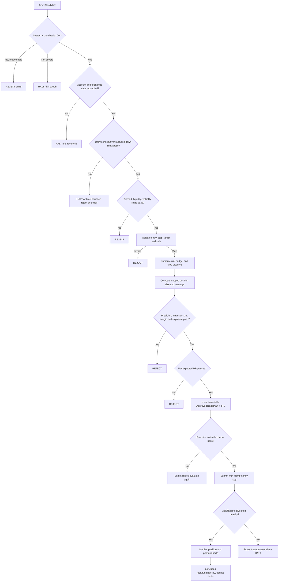

# Risk Management Flow — PHASE 1

## 1. Vai trò và trust boundary

Risk Engine là lớp độc lập, deterministic và có quyền phủ quyết tuyệt đối mọi
`TradeCandidate`. Nó không cố gắng tìm cơ hội giao dịch; nhiệm vụ là giới hạn tổn
thất và từ chối hành động khi trạng thái không chắc chắn.

Risk Engine chỉ phát hành `ApprovedTradePlan` sau khi toàn bộ pre-trade checks pass.
Approval có ID, config/state version và thời hạn. Executor không được gửi order nếu
approval thiếu, hết hạn, đã dùng hoặc context quan trọng đã đổi.

## 2. Risk flow



## 3. Risk configuration

Không có ngưỡng an toàn nào nằm rải rác trong strategy code. Typed config phải chứa,
ít nhất:

- `risk_per_trade`, `max_leverage`, `max_position_notional`.
- `max_daily_loss`, `max_daily_trades`, `max_consecutive_losses`.
- `minimum_rr`, `max_allowed_spread`, `max_slippage`.
- `cooldown_after_loss`, daily reset timezone và reset policy.
- Max open positions/exposure (MVP dự kiến một position trên symbol).
- Data/API health timeout, approval TTL và reconciliation tolerance.
- Emergency exit, partial fill và protective-stop failure policies.

Giá trị cụ thể sẽ được chốt ở PHASE 2 và kiểm chứng bằng backtest/paper trading.
Leverage demo ban đầu có thể nghiên cứu trong phạm vi x3–x5, nhưng Risk Engine luôn
áp `max_leverage`; AI/strategy không có quyền thay đổi limit.

## 4. Position sizing theo rủi ro tại stop

Với linear USDT-margined swap, mô hình khái niệm:

```text
risk_budget_usdt = eligible_equity × risk_per_trade
stop_distance_abs = abs(entry_price - stop_price)
stop_distance_fraction = stop_distance_abs / entry_price

raw_notional = risk_budget_usdt / stop_distance_fraction
```

Sizing thực tế không dừng ở công thức trên. Phải điều chỉnh cho:

- Estimated entry + stop-exit fee.
- Conservative slippage ở entry và stop.
- Instrument contract value, lot size, tick size và minimum order size.
- Available margin, current exposure, max notional và leverage cap.
- Rounding luôn theo hướng không làm tăng rủi ro.

Một dạng budget an toàn hơn cần được đặc tả ở PHASE 2:

```text
loss_per_notional = adverse_price_move_fraction
                    + entry_fee_rate
                    + stop_exit_fee_rate
                    + slippage_buffer_fraction

cost_adjusted_notional = risk_budget_usdt / loss_per_notional
approved_notional = min(
    cost_adjusted_notional,
    max_position_notional,
    equity_based_leverage_cap,
    available_margin_cap,
    exposure_cap
)
```

Sau khi quantize quantity, engine phải tính ngược worst-case loss. Nếu vượt budget
hoặc quantity dưới minimum exchange size thì reject; không round lên để ép giao dịch.

### Ví dụ minh họa, không phải config mặc định

Nếu eligible equity là 10,000 USDT, risk/trade là 0.5%, entry 80,000 và stop 79,200,
risk budget là 50 USDT, stop distance là 1%, nên raw notional trước phí/slippage là
5,000 USDT. Final notional phải nhỏ hơn con số này sau cost adjustment và các cap.
Leverage chỉ quyết định margin cần dùng, không thay đổi số USDT được phép mất.

## 5. Stop-loss và take-profit validation

Mọi entry phải có protective stop trước khi được approve:

- LONG: `stop < entry`; SHORT: `stop > entry`.
- Stop xuất phát từ swing/structure/S&R với ATR buffer cấu hình được; không dùng một
  fixed percentage cho mọi regime.
- Khoảng stop quá nhỏ so với tick/spread/noise hoặc quá lớn so với risk policy đều reject.
- Target phải có logic thị trường và không bị một level gần hơn làm RR phi thực tế.
- Expected RR phải tính bằng reward/loss sau estimated entry/exit fees và slippage.
- Executor/Position Manager phải xác nhận stop tồn tại trên sàn cho filled quantity.

MVP có thể bắt đầu với một stop và một TP để giảm state complexity. TP1/TP2,
break-even và trailing stop chỉ thêm sau khi semantics cho partial fills và restart
recovery đã được test.

## 6. Các lớp kiểm soát

### Pre-trade

- Health/freshness/config/security checks.
- Account, order và position reconciliation.
- Regime/decision/candidate schema validation.
- Daily loss, trade count, consecutive losses và cooldown.
- Spread/slippage budget, size/leverage/notional/margin/exposure.
- Stop/target/RR và exchange precision.

### In-flight execution

- Idempotent client order ID; query-before-retry khi outcome không rõ.
- Theo dõi ack, reject, timeout, partial fill và cumulative quantity.
- Revalidate protection theo actual average fill; không tăng quantity ngoài approval.
- Nếu protection thất bại: cancel unfilled remainder, cố đặt protection/reduce-only
  theo emergency policy và kích hoạt halt.

### Post-trade/continuous

- Reconcile open orders, fills, position, margin và protective orders.
- Tính realized loss, fees, funding và daily/consecutive counters từ ledger.
- Theo dõi drawdown, equity/margin anomalies, latency, spread và slippage.
- Không mở position mới trong lúc state không chắc chắn hoặc kill switch active.

## 7. Daily limits và loss accounting

- Daily boundary phải được khai báo rõ (khuyến nghị UTC) và persist qua restart.
- `max_daily_loss` dùng realized net PnL sau fees/funding; có thể bổ sung unrealized
  risk/equity drawdown gate riêng để phản ứng trước vị thế chưa đóng.
- Trade count chỉ tăng theo định nghĩa được chốt (khuyến nghị một position lifecycle,
  không phải mỗi partial fill).
- Consecutive loss chỉ cập nhật khi lifecycle đóng hoàn toàn; hòa vốn semantics phải rõ.
- Cooldown bắt đầu từ lúc loss được xác nhận, dùng persisted timestamp.
- Reset ngày không tự xóa một kill switch chưa được operator acknowledge.

## 8. Kill switch

Các trigger tối thiểu:

- Daily loss/drawdown hoặc consecutive losses vượt giới hạn.
- Market data thiếu/stale kéo dài; API/WebSocket lỗi nghiêm trọng.
- Spread/slippage bất thường theo configured threshold.
- Không đặt hoặc xác nhận được protective stop.
- Local state khác exchange state và không reconcile được.
- Equity, balance hoặc margin biến động bất thường.
- Journal/database không ghi được audit-critical event.

Kill switch action order phụ thuộc tình huống nhưng tuân các nguyên tắc:

1. Atomically chặn mọi entry mới.
2. Ghi `KILL_SWITCH_TRIGGERED` với trigger, snapshot, timestamps và correlation IDs.
3. Cancel pending entry orders khi an toàn; không hủy protection mù quáng.
4. Reconcile exposure và bảo vệ/reduce vị thế theo emergency policy.
5. Alert operator và duy trì monitoring.
6. Chỉ reset khi nguyên nhân đã xử lý, state đã reconcile và operator tạo audit event.

`HALTED` không đồng nghĩa process dừng hoàn toàn: risk-reducing actions và quan sát
vẫn phải hoạt động. Mọi tình huống không chắc chắn đều fail closed đối với entry mới.

## 9. Risk reason codes dự kiến

- Limits: `DAILY_LOSS_LIMIT`, `DAILY_TRADE_LIMIT`, `CONSECUTIVE_LOSS_LIMIT`,
  `LOSS_COOLDOWN_ACTIVE`.
- Market: `SPREAD_TOO_WIDE`, `SLIPPAGE_BUDGET_EXCEEDED`, `VOLATILITY_BLOCKED`.
- Plan: `INVALID_STOP`, `STOP_TOO_CLOSE`, `STOP_TOO_FAR`, `RR_BELOW_MINIMUM`.
- Sizing: `SIZE_BELOW_MINIMUM`, `POSITION_CAP_EXCEEDED`, `LEVERAGE_CAP_EXCEEDED`,
  `INSUFFICIENT_MARGIN`, `RISK_BUDGET_EXCEEDED`.
- Health/state: `DATA_UNHEALTHY`, `API_UNHEALTHY`, `STATE_MISMATCH`,
  `JOURNAL_UNAVAILABLE`, `PROTECTION_FAILED`, `APPROVAL_EXPIRED`.

Mỗi reject/halt lưu cả code ổn định, giới hạn áp dụng, observed value và unit; tránh
chỉ ghi message tự do không thể phân tích.

## 10. Risk tests bắt buộc ở các phase triển khai

- Unit/boundary tests cho risk budget, cap, fee/slippage adjustment và precision rounding.
- Chứng minh worst-case loss sau rounding không vượt risk budget.
- Stop validation cho LONG/SHORT, zero/negative distance, tick edge và gap scenario.
- Daily loss/trade/consecutive counters qua midnight và restart.
- Cooldown persistence và clock handling.
- Kill-switch trigger, idempotency, persistence và manual-reset guard.
- Spread/slippage ở đúng, dưới và trên boundary.
- Reject stale approval và config/state version mismatch.
- Order validation: missing SL/TP, invalid side, size, price, reduce-only và duplicate ID.
- Partial fill, unknown submit result, failed stop placement và local/exchange mismatch.
- Property tests: Risk Engine không approve khi bất kỳ hard gate nào fail.
- Integration/contract tests bảo đảm Executor không nhận candidate thiếu approval.

## 11. Giới hạn hiện tại

PHASE 1 chưa chốt numerical thresholds, contract multiplier, liquidation/margin formula,
OKX order semantics hoặc emergency exit implementation. Vì vậy các công thức là
model thiết kế, chưa được dùng để giao dịch. Funding, gap-through-stop, liquidation,
latency và market impact phải được mô hình hóa bảo thủ trong PHASE 2/Backtest trước
khi đánh giá profitability hoặc chuyển sang Demo execution.
