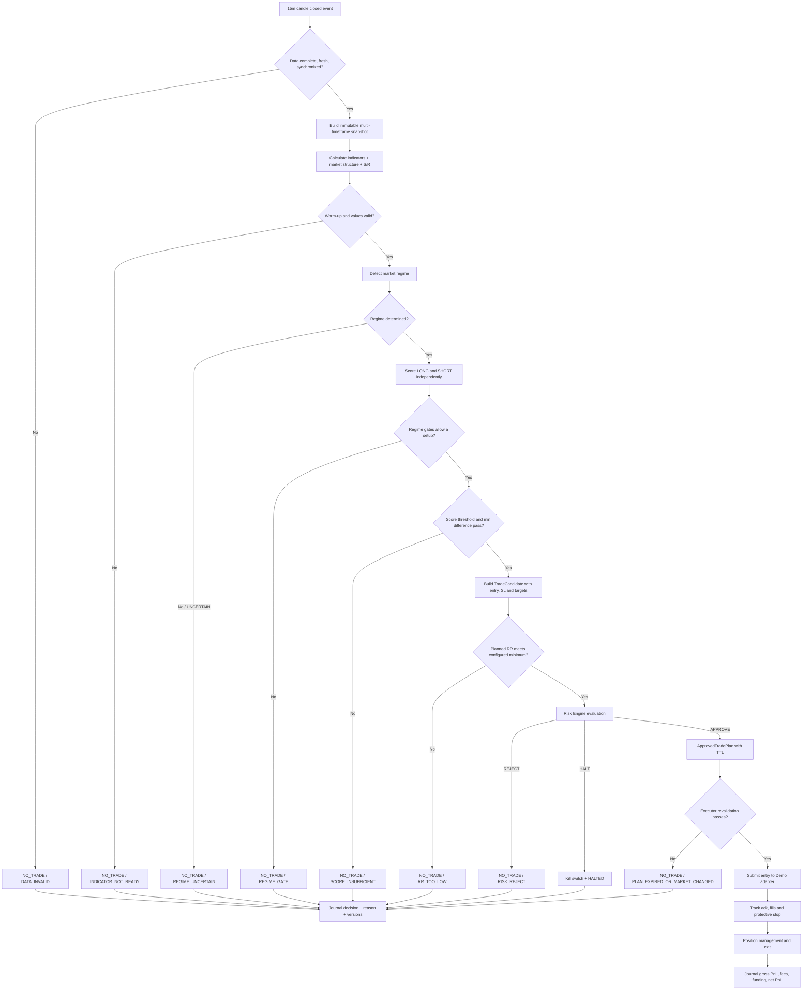
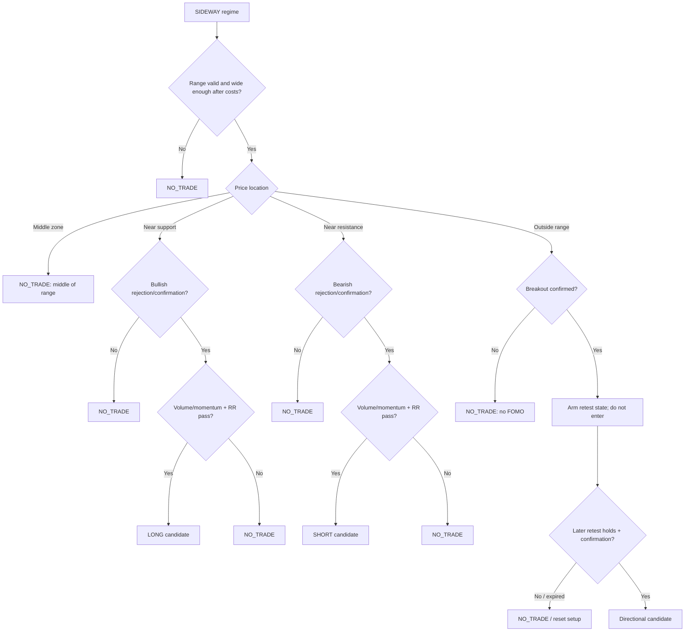

# Trading Decision Flow — PHASE 1

## 1. Mục tiêu

Luồng quyết định tạo một kết quả giải thích được tại mỗi lần candle 15m đóng:
`LONG`, `SHORT` hoặc `NO_TRADE`. Không có tín hiệu cũng là thông tin và phải được
ghi journal. Tần suất event có thể thay đổi ở PHASE 2, nhưng không được đánh giá
lặp trên cùng một candle bằng cùng config/data version.

## 2. Trading flow tổng thể



Các node execution trong sơ đồ là thiết kế cho phase sau, không phải code hiện có.

## 3. Input snapshot và timing

Tại event đóng candle 15m ở thời điểm `T`:

- Chỉ candle có `close_time <= T` và `is_closed=true` được dùng.
- 5m phải đủ các candle con dự kiến đến `T`; 1h dùng candle 1h đã đóng gần nhất,
  không dùng candle 1h đang hình thành.
- Bid/ask và account context có freshness riêng; snapshot cũ không được tái dùng để
  phê duyệt order mới.
- Mỗi evaluation có `evaluation_id`, `as_of`, `data_version`, `config_version` và
  `strategy_version` để chống duplicate và tái lập kết quả.

## 4. Regime gate

Regime detector trả một trong năm trạng thái, kèm evidence và lý do:

- `TREND_UP`: chỉ cho phép cân nhắc LONG theo trend trong MVP; SHORT counter-trend
  mặc định bị gate, trừ khi một strategy riêng được thiết kế/test sau này.
- `TREND_DOWN`: đối xứng, chỉ cân nhắc SHORT theo trend trong MVP.
- `SIDEWAY`: chỉ cân nhắc mean-reversion tại biên hoặc breakout đã confirm + retest.
- `HIGH_VOLATILITY`: mặc định `NO_TRADE`; nếu tương lai cho phép thì phải có policy,
  limit và backtest riêng, không tự suy ra từ trend.
- `UNCERTAIN`: luôn `NO_TRADE`.

Regime không tự tạo lệnh. Nó chỉ giới hạn setup nào được phép đi tiếp.

## 5. SIDEWAY flow

SIDEWAY cần một `RangeContext` hợp lệ gồm support, resistance, range width, age,
số lần test và invalidation state. Khoảng cách “gần biên” phải chuẩn hóa theo ATR
hoặc range width và lấy từ config; không hard-code theo giá BTC.



Breakout là một setup nhiều event, không phải điều kiện trong một candle. Trạng thái
`DETECTED → CONFIRMED → WAITING_RETEST → RETEST_VALID/EXPIRED/INVALIDATED` phải được
lưu để backtest và restart recovery có cùng hành vi.

## 6. Signal scoring

Long và short được chấm độc lập từ 0–100. Tổng trọng số và mọi threshold nằm trong
config có version. Không có indicator đơn lẻ nào tự quyết định giao dịch.

Nhóm component dự kiến:

- Higher-timeframe trend và EMA structure.
- RSI/momentum và volume confirmation.
- Candle confirmation.
- Support/resistance, khoảng cách tới level và range location.
- Breakout/retest state.
- ATR/volatility suitability.
- HH/HL/LH/LL market structure.
- Planned risk/reward sau estimated costs.

Điều kiện direction hợp lệ ở mức thiết kế:

```text
eligible_long = regime_allows_long
                AND long_score >= configured_long_threshold
                AND (long_score - short_score) >= configured_min_difference

eligible_short = regime_allows_short
                 AND short_score >= configured_short_threshold
                 AND (short_score - long_score) >= configured_min_difference
```

Nếu cả hai cùng pass do cấu hình sai hoặc rounding, kết quả là `NO_TRADE` với
`AMBIGUOUS_SIGNAL`, không tự chọn phía có điểm lớn hơn. Score chỉ có ý nghĩa sau khi
được calibration/backtest; ví dụ 65/100 không mặc nhiên là tốt.

## 7. Từ signal đến trade candidate

Candidate phải được xây theo thứ tự:

1. Chọn side và entry model dựa trên setup đã pass.
2. Xác định invalidation level từ structure/swing/S&R và ATR buffer cấu hình được.
3. Kiểm tra stop nằm đúng phía entry, có khoảng cách dương và không phi thực tế.
4. Xác định TP1/TP2 hoặc target model; tính RR dự kiến sau conservative cost estimate.
5. Nếu RR không đạt minimum hoặc target bị cản bởi S/R gần hơn: `NO_TRADE`.
6. Gửi candidate (chưa có quyền execution) sang Risk Engine để sizing/veto.

Strategy không được sửa stop để làm RR đẹp hơn và không được truyền desired leverage
như một cách ép position size.

## 8. Decision reason taxonomy

Reason code phải ổn định để analytics tổng hợp được, trong khi human-readable detail
có thể phong phú hơn:

- Data: `DATA_MISSING`, `DATA_STALE`, `TIMEFRAME_UNSYNCED`, `WARMUP_INCOMPLETE`.
- Regime: `REGIME_UNCERTAIN`, `HIGH_VOLATILITY_BLOCKED`, `REGIME_DIRECTION_BLOCKED`.
- Setup: `MID_RANGE`, `NO_CONFIRMATION`, `RETEST_PENDING`, `RETEST_INVALIDATED`.
- Score: `LONG_SCORE_LOW`, `SHORT_SCORE_LOW`, `SCORE_DIFFERENCE_LOW`, `AMBIGUOUS_SIGNAL`.
- Trade plan: `INVALID_STOP`, `RR_TOO_LOW`, `LEVEL_TOO_CLOSE`.
- Risk/execution: dùng risk reason codes định nghĩa trong risk document.

Mỗi record lưu component scores, giá trị indicator, levels, regime evidence và các
gate đã áp dụng — không chỉ lưu score cuối.

## 9. Journal event sequence

Một evaluation tối thiểu tạo `DECISION_EVALUATED`. Nếu đi tiếp, journal lần lượt ghi
`RISK_EVALUATED`, `ORDER_INTENT_CREATED`, `ORDER_SUBMITTED`, `ORDER_ACKNOWLEDGED`,
`FILL_RECEIVED`, `PROTECTION_CONFIRMED`, `POSITION_UPDATED`, `EXIT_COMPLETED`.

Không overwrite lịch sử. Correction/reconciliation tạo event mới liên kết record cũ.
Net PnL phải tách `gross_pnl`, entry/exit fees, funding và slippage estimate/realized.

## 10. Testability requirements cho các phase sau

- Cùng input snapshot + config + state phải cho cùng decision.
- Boundary tests cho từng regime gate, threshold và minimum score difference.
- Property tests: score luôn 0–100; stop đúng phía; size/risk không âm.
- Scenario tests cho SIDEWAY middle/edge, false breakout, confirm/retest/expiry.
- Test chứng minh chưa-đóng candle không ảnh hưởng quyết định hiện tại.
- Golden tests cho journal reason codes và component breakdown.
- Backtest và paper path phải cho cùng pre-execution decision trên cùng snapshot.
